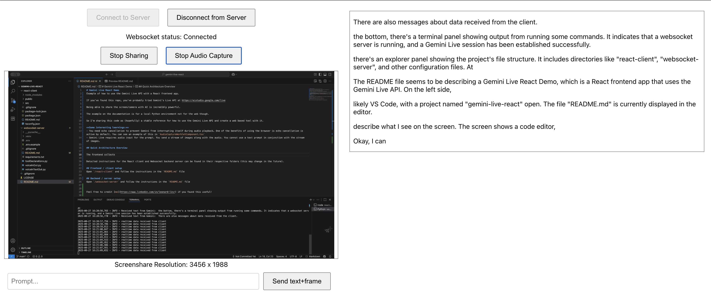

# Gemini Live React Demo
Example of how to use the Gemini Live API with a React frontend app. 

If you've found this repo, you've probably tried Gemini's Live API at https://aistudio.google.com/live

Being able to share the screen/camera with AI is incredibly powerful. 

The example on the documentation is for a local Python environment not for the web though. 

So I'm sharing this code as (hopefully) a stable reference for how to use the Gemini Live API and create a web based tool with it.

**Some interesting learnings:** 
- You need echo cancellation to prevent Gemini from interrupting itself during audio playback. One of the benefits of using the browser is echo cancellation is active by default. You can see an example of this in `AudioCaptureWorkletComponent.tsx`
- Gemini Live requires audio input for the prompt. You send a stream of images along with the audio. You cannot use a text prompt in conjunction with the stream of images. 
- Images larger than 384 x 384 pixels are split into multiple tiles of 768 x 768 pixels. See documentation [here](https://ai.google.dev/gemini-api/docs/tokens?lang=python). Each tile counts as **258 tokens**. I scale the captured screenshare to 1024 pixels width (height is scaled accordingly to keep the aspect ratio). Edit `const maxWidth = 1024;` in `useScreenShare.ts` if you want to change this behaviour.
- The image capture interval is set at **1 fps**. You can edit this behaviour by changing `captureIntervalRef.current = setInterval(captureFrame, 1000);` in `useScreenShare.ts`
- Despite gemini_config > "response_modalities" being a list, you can only specify either "AUDIO" or "TEXT" (one value only). See the documentation [here](https://ai.google.dev/gemini-api/docs/live-guide#response-modalities).

## Quick Architecture Overview

The frontend collects audio from your microphone once you click the "Start Audio Capture" button. If you also started sharing your screen, both the audio and image data will be sent to the backend server as base64 strings. The backend will then send the audio and images to Gemini Live API as raw PCM audio and JPEG images.

Detailed instructions for the React client and Websocket backend server can be found in their respective folders (this may change in the future). 

## Frontend / client setup 
Open `/react-client` and follow the instructions in the `README.md` file

## Backend / server setup 
Open `/websocket-server` and follow the instructions in the `README.md` file

Feel free to credit [me](https://www.linkedin.com/in/leonard-lin/) if you found this useful! 
